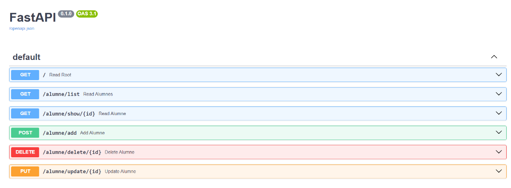
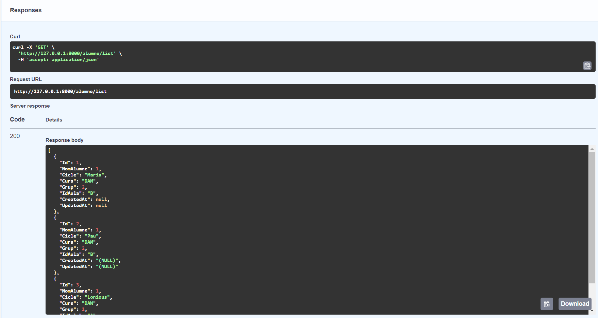
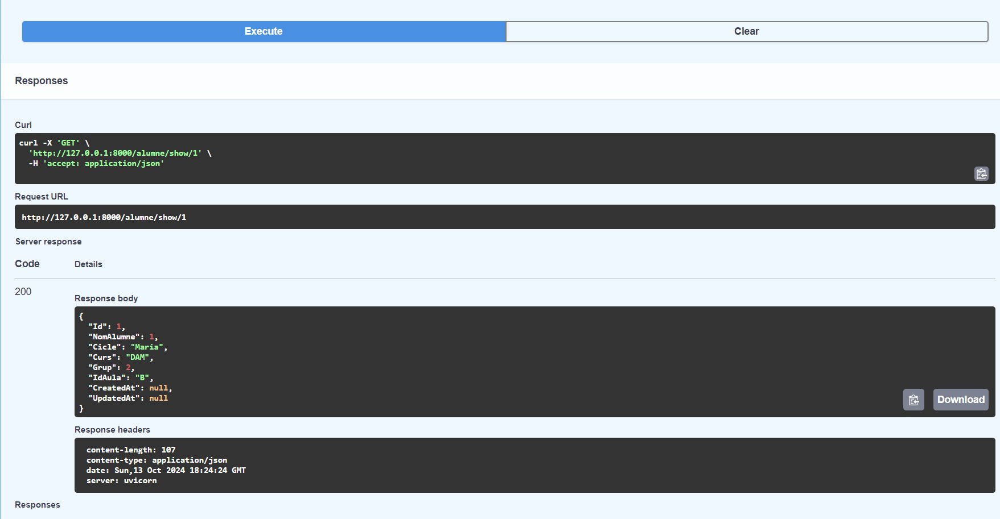
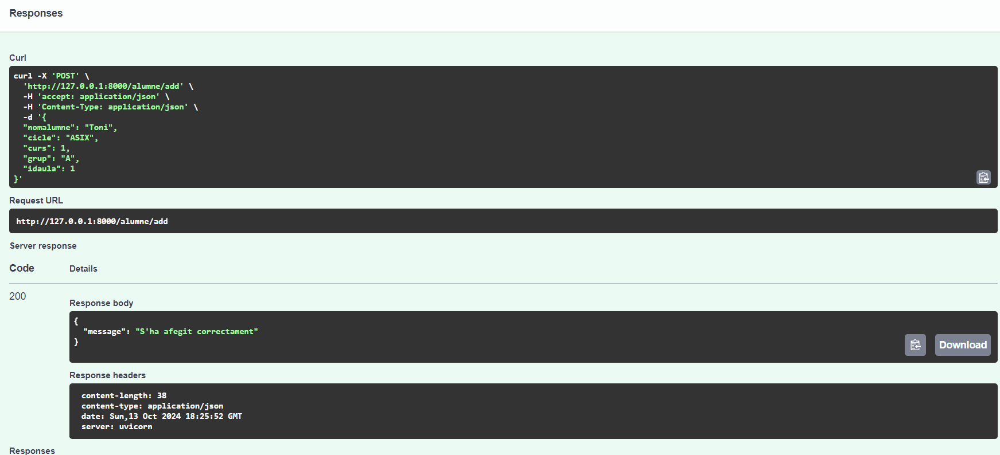
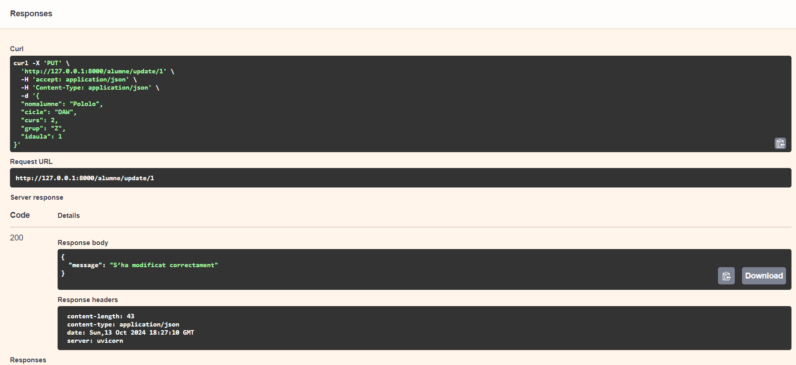
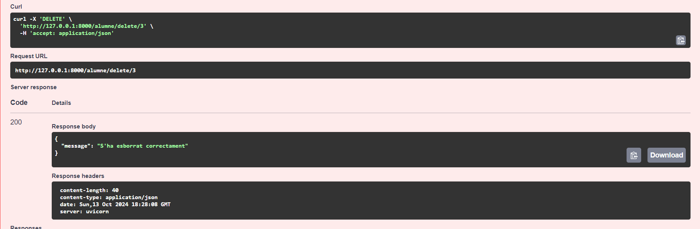

# Act1FastApi

El programa es una API diseñada para gestionar estudiantes en una base de datos MySQL, permitiendo realizar operaciones como consultar, agregar, actualizar y eliminar registros. 

Ofrece endpoints que facilitan la obtención de una lista completa de estudiantes, la consulta de un estudiante específico mediante su ID y la incorporación de nuevos registros en la base de datos. Además, permite la actualización de la información de un estudiante existente y la eliminación de registros cuando sea necesario. 

A continuación, veremos una serie de capturas que ilustrarán de forma más visual como funciona el programa, mostrando diferentes casos prácticos y su aplicación en situaciones reales.

Comenzando con una captura del crud, que muestra las diferentes operaciones disponibles.

La siguiente captura muestra el endpoint get all, que devuelve la lista completa de estudiantes registrados en la base de datos. Esta imagen permite observar de manera clara como se estructura los datos de cada estudiante.

Como se puede observar en la imagen del endpoint get by ID, esta funcionalidad nos permite visualizar la información de un alumno especifico de manera más sencilla utilizando su identificador unico.

 La siguiente captura muestra el endpoint post, que permite agregar un nuevo alumno a la base de datos. Esta funcionalidad facilita la incorporación de información relevante, como el nombre, curso, y mas. 
 

En esta imagen se presenta el endpoint update, que permite modificar la información de un alumno existente en la base de datos.

Este endpoint delete, que vemos en la imagen, permite eliminar un alumno especifico de la base de datos.

El endpoint get que se muestra en la imagen permite visualizar los resultados de las operaciones de update y delete. Esta funcionalidad es crucial para verificar que los cambios realizados en la base de datos se hayan ejecutado correctamente.

